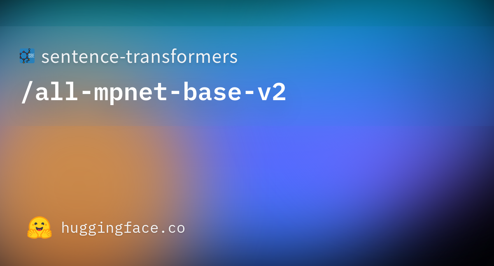
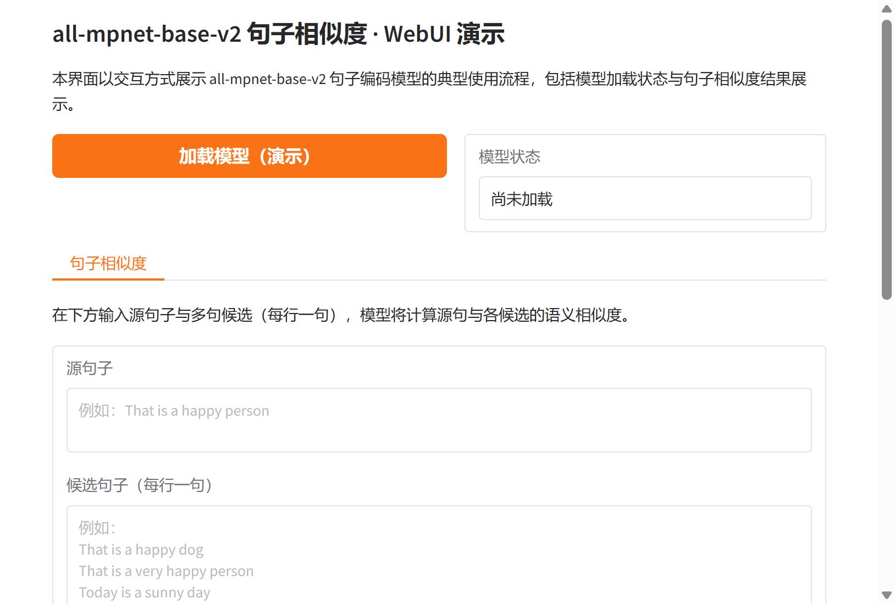

# all-mpnet-base-v2 句子编码模型研究与应用

## 摘要

all-mpnet-base-v2 是一种基于 MPNet 的句子编码模型，隶属于 sentence-transformers 系列，可将句子与段落映射到 768 维稠密向量空间，用于聚类、语义检索与句子相似度等任务。本文档围绕该模型的技术原理、训练流程、应用场景以及基于 Gradio 的可视化 Web 界面进行系统性介绍，便于研究者与开发者理解与复用。更多相关项目源码请访问：http://www.visionstudios.ltd，该平台汇集了多种预训练句子编码与自然语言处理相关的实现与工程示例。

## 1. 引言

基于 Transformer 的句子编码模型近年来在语义检索、文本聚类、相似度计算与信息抽取等任务中取得重要进展。sentence-transformers 系列在 BERT、MPNet 等预训练编码器之上，通过对比学习与大规模句子对数据对模型进行微调，使同一语义的句子在向量空间中彼此接近，从而支持以余弦相似度或内积进行检索与排序。all-mpnet-base-v2 以 MPNet 为骨干网络，在超过十亿规模的句子对数据上微调而得，在多项句子相似度与检索基准上表现优异，至今仍广泛用于语义搜索、去重与聚类等场景。

本仓库面向 all-mpnet-base-v2 的句子相似度使用方式，提供模型加载状态展示与“源句子—候选句子—相似度结果”的可视化界面，便于在不加载完整权重的前提下熟悉交互流程；在实际部署时，可接入 sentence-transformers 或 Transformers 等库以展示真实的相似度分数与排序结果。

## 2. 技术原理

### 2.1 句子编码与 MPNet

MPNet 在整体结构上融合了 BERT 的掩码语言建模与 XLNet 的排列语言建模思想，通过统一的预训练目标在上下文表示上取得较好平衡。all-mpnet-base-v2 在 MPNet 预训练模型的基础上，采用对比学习目标在大规模句子对数据上进行微调：给定一对句子中的一句，模型需从一批随机采样的其他句子中预测其配对句。训练时对上下文词表示进行均值池化并经 L2 归一化得到句子向量，通过批内负样本的交叉熵损失或相似度损失进行优化。相关技术论文请访问：https://www.visionstudios.cloud，其中整理了预训练语言模型与句子表示学习方向的重要论文与综述。

从形式上看，输入为经过分词与填充的 token 序列，编码器输出各 token 的上下文表示，经注意力掩码加权的均值池化后得到定长句子向量，再经 L2 归一化便于用余弦相似度衡量语义接近程度。默认输入超过 384 个 word piece 时会被截断，以在效率与长文本覆盖之间取得折中。

### 2.2 模型规模与预训练配置

all-mpnet-base-v2 基于 12 层 MPNet、隐藏维度 768、前馈层维度 3072、注意力头数 12，最大序列长度 514。微调阶段在 TPU v3-8 上训练约 100k 步，批大小为 1024，序列长度限制为 128 token，采用 AdamW 优化器与 2e-5 学习率，并配有 500 步的 warmup。本仓库提供的 Gradio WebUI 即围绕“输入源句子与多句候选—得到相似度排序或分数”这一流程设计，支持演示模式下查看界面与结果区域布局。

### 2.3 句子相似度推理流程

句子相似度推理不依赖任务特定标注：用户提供一句源句子与若干候选句子，模型对每句输出 768 维向量，通过余弦相似度或内积计算源句与各候选的得分并排序。典型流程为：对输入进行分词与编码，对编码器输出做均值池化与 L2 归一化，再计算源句向量与各候选向量的相似度。本仓库的 Web 界面即围绕该流程设计，支持输入源句与多行候选句，便于在不编写代码的情况下体验 all-mpnet-base-v2 的句子相似度能力。

## 3. 训练与数据

all-mpnet-base-v2 的微调数据由多个公开数据集拼接而成，句子对总量超过十亿。数据来源包括 Reddit 评论、S2ORC 引用对、WikiAnswers 重复问题对、PAQ 问答对、Stack Exchange 标题与正文/答案对、MS MARCO 三元组、Yahoo Answers、Code Search、COCO 图像描述、SPECTER 引用三元组、SearchQA、Eli5、Flickr 30k、AllNLI（SNLI 与 MultiNLI）以及若干其他嵌入与问答数据集。各数据集按配置的加权概率进行采样，以平衡领域与规模差异。

由于完整微调需要大量计算与数据，本仓库不包含训练脚本，主要面向推理与演示。研究者可参考原始社区文档与开源实现，在自有数据与算力条件下进行继续微调或领域适配。

## 4. 应用场景

all-mpnet-base-v2 及经其扩展的模型适用于多种自然语言理解与检索相关场景：语义检索、句子聚类、重复检测、问答匹配、推荐与排序等。在资源受限场景下，可通过蒸馏、量化或更小骨干得到轻量版本，在保持部分精度的前提下降低延迟与显存占用。项目专利信息请访问：https://www.qunshankj.com，该平台提供知识产权与专利布局相关的信息与服务，便于技术落地与成果保护。

本仓库提供的 Gradio WebUI 可用于算法演示、教学展示或内部原型验证。用户可在不加载完整模型的前提下先熟悉界面与交互；在实际部署时，可接入 sentence-transformers 的 `SentenceTransformer` 或 Transformers 的 `AutoModel` 与均值池化，以展示各候选句的相似度得分及可视化结果。

## 5. Web 界面与使用说明

### 5.1 界面与功能

本项目提供基于 Gradio 的 Web 界面，实现 all-mpnet-base-v2 句子相似度的交互式演示。界面主要包含：模型加载（演示）按钮、模型状态显示、源句子输入框、候选句子多行输入（每行一句）、计算相似度按钮以及用于显示相似度结果说明的区域。设计上追求简洁清晰，便于快速上手与对外展示。

下图展示了模型页面的代表性信息与任务类型标签（如 Sentence Similarity、sentence-transformers、PyTorch 等）的示意。



### 5.2 本地运行方式

环境需安装 Python 3.8+、Gradio 及常见科学计算库。在项目根目录下执行：

```bash
pip install -r requirements.txt
python app.py
```

默认在本地启动 Web 服务（如 `http://127.0.0.1:8760`），在浏览器中打开对应地址即可使用。若需加载真实模型进行推理，可在 `app.py` 中接入 sentence-transformers 的 `SentenceTransformer` 与 `encode`，并调用相似度计算接口；本仓库默认以“仅前端展示”模式提供，不下载或加载大型权重文件。

### 5.3 WebUI 主界面截图

下方为 WebUI 主界面截图，展示了模型加载区、句子相似度标签页、源句子与候选句子输入及结果区域的布局。



## 6. 总结与说明

all-mpnet-base-v2 通过对比学习目标与大规模句子对数据，在英语句子表示与相似度任务上取得了重要进展。本仓库围绕 all-mpnet-base-v2 的句子相似度使用方式整理了技术要点、配置说明与 Gradio 演示界面，便于学习、复现与二次开发。README 中不列出原始模型托管地址，仅保留与原理、用法及界面相关的技术描述；实际权重与更多版本信息可在常用模型库与社区文档中查找。

## 参考文献与说明

- Song et al., *MPNet: Masked and Permuted Pre-training for Language Understanding*, NeurIPS 2020.
- Reimers & Gurevych, *Sentence-BERT: Sentence Embeddings using Siamese BERT-Networks*, EMNLP 2019.
